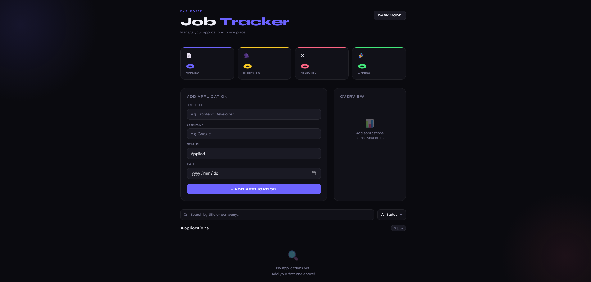
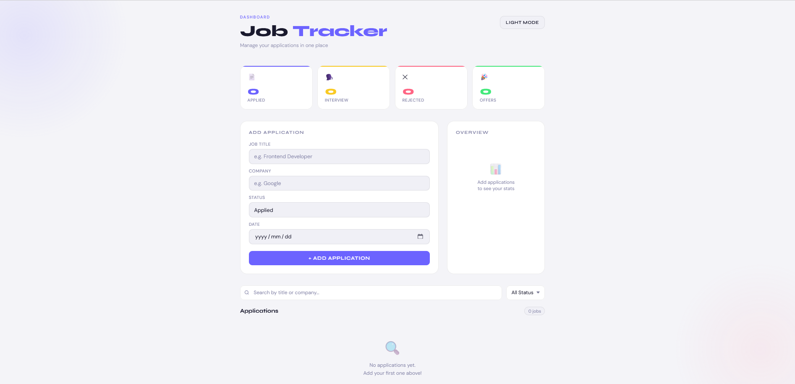
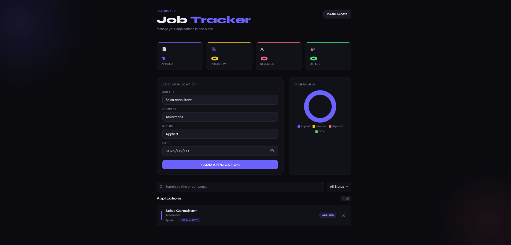
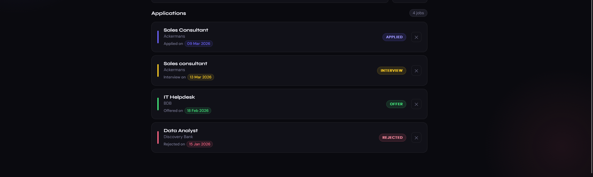

# Job Application Tracker

A simple, web-based dashboard to manage and track your job applications in one place.

## Live Demo

Check out the project live [here](https://Imma1114.github.io/job-application-tracker/).  

## Author

**Immaculate Nhlanhla Modise**  
- Email: immaculatenhlanhlamodise14@gmail.com  
- LinkedIn: [https://www.linkedin.com/in/immaculatemodise](https://www.linkedin.com/in/immaculatemodise)  
- GitHub: [https://github.com/Imma1114](https://github.com/Imma1114)  

## Features

- Add job applications with title, company, status, and date.
- View applications in a clear list with status indicators.
- Overview chart showing applications by status.
- Dark and light mode toggle.
- Search and filter applications by title, company, or status.
- Local storage support (your data stays in your browser).

## Screenshots

**Dark Mode:**  
  

**Light Mode:**  
  

**Adding a Job:**  
  

**Applications List:**  
  

## How to Use

1. Open `index.html` in a browser.
2. Fill in the **Job Title**, **Company**, **Status**, and **Date** fields.
3. Click **+ Add Application** to save.
4. Use the **Search** bar or **Filter** dropdown to find specific jobs.
5. Toggle **Dark Mode** for a light theme.

## Technologies Used

- HTML5  
- CSS3  
- JavaScript (ES6)  
- Chart.js  
- LocalStorage  

## License

This project is free to use and modify.
